# 🩺 SwasthAI — Complete System Architecture

> **SwasthAI** is a multilingual AI healthcare triage assistant that processes text, voice, and image inputs to determine medical urgency and deliver actionable healthcare guidance — including self-care advice, clinic recommendations, emergency alerts, nearby hospital suggestions, AI voice responses, and patient summary reports. Users can access SwasthAI through the **Website** (Landing Page + Chatbot) or via **WhatsApp** (single connected phone).

---

## Table of Contents

1. [Project Overview](#1-project-overview)
2. [High-Level Architecture](#2-high-level-architecture)
3. [User Layer](#3-user-layer)
4. [Frontend Layer — Website](#4-frontend-layer--website)
5. [WhatsApp Integration Layer](#5-whatsapp-integration-layer)
6. [API Gateway Layer](#6-api-gateway-layer)
7. [AI Processing Pipeline](#7-ai-processing-pipeline)
8. [Healthcare Services Layer](#8-healthcare-services-layer)
9. [Data Storage Layer](#9-data-storage-layer)
10. [Analytics Layer](#10-analytics-layer)
11. [Infrastructure & Deployment](#11-infrastructure--deployment)
12. [Team Task Division](#12-team-task-division)
13. [End-to-End System Flow](#13-end-to-end-system-flow)

---

## 1. Project Overview

SwasthAI enables users to:

| Input Method | Description |
|---|---|
| **Text Input** | Describe symptoms in natural language (e.g., *"I have fever and headache"*) |
| **Voice Input** | Speak symptoms via a microphone button (e.g., *"My chest hurts when breathing"*) |
| **Image Upload** | Upload photos of wounds, rashes, swelling, or burns |
| **Quick Symptom Buttons** | One-tap symptom selection: Fever, Pain, Headache, Wound, Breathing Issue, Bleeding |

**Access Channels:**

| Channel | Description |
|---|---|
| **🌐 Website** | Landing page showcasing SwasthAI features + embedded AI chatbot |
| **📱 WhatsApp Bot** | Single connected phone number — users message the bot directly on WhatsApp |

**Target Outputs and Current Status:**

- ✅ Self-care triage response
- ✅ Clinic triage response
- ✅ Emergency triage response with `108` guidance
- ❌ Nearby hospital suggestions (GPS-based)
- ❌ AI voice response (multilingual)
- ❌ Patient summary report

Anonymous analytics storage is also part of the target architecture, but it is not implemented yet.

---

## Current Implementation Status

**As of March 21, 2026**

**Legend**

- ✅ COMPLETED
- ⚠ PARTIAL
- ❌ NOT IMPLEMENTED

| Area | Status | Reality |
|---|---|---|
| FastAPI backend app | ✅ | Working backend entrypoint exists |
| `POST /analyze` | ✅ | Working MVP endpoint for text symptom analysis |
| Request validation | ✅ | Pydantic request model validates input |
| Response schema | ✅ | Structured JSON response model is implemented |
| Text symptom input | ✅ | Supported through backend API |
| Session management | ⚠ | In-memory only, no persistent storage |
| Emergency rule engine | ✅ | Keyword-based emergency detection is implemented |
| AI triage engine | ✅ | Groq-backed when configured, rule-based fallback otherwise |
| Remedies / recommended actions | ⚠ | Basic recommendations exist, not clinically robust |
| Frontend website/chatbot | ⚠ | Vite React frontend exists with landing page and live text chat, but several planned features are still missing |
| WhatsApp bot integration | ❌ | Architecture exists on paper, not as a working system |
| Voice input / speech-to-text | ❌ | Not implemented |
| Image upload / analysis | ❌ | Not implemented |
| Multilingual translation flow | ❌ | Not implemented in the MVP path |
| Hospital recommendations | ❌ | Not implemented in the running MVP |
| TTS audio response | ❌ | Not implemented in the running MVP |
| Database persistence | ❌ | No real persistence layer is wired into the MVP |
| Analytics | ❌ | Not implemented |

---

## 2. High-Level Architecture

SwasthAI consists of **8 major layers**:

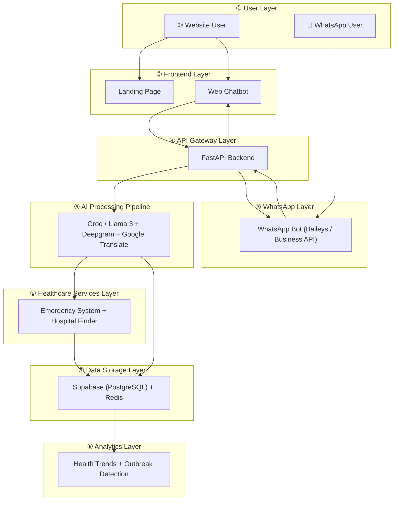

---

## 3. User Layer

Users interact with SwasthAI through **two channels**: the Website or WhatsApp.

**Current Status:** ⚠ The website channel exists as a Vite React app. WhatsApp is still not implemented.

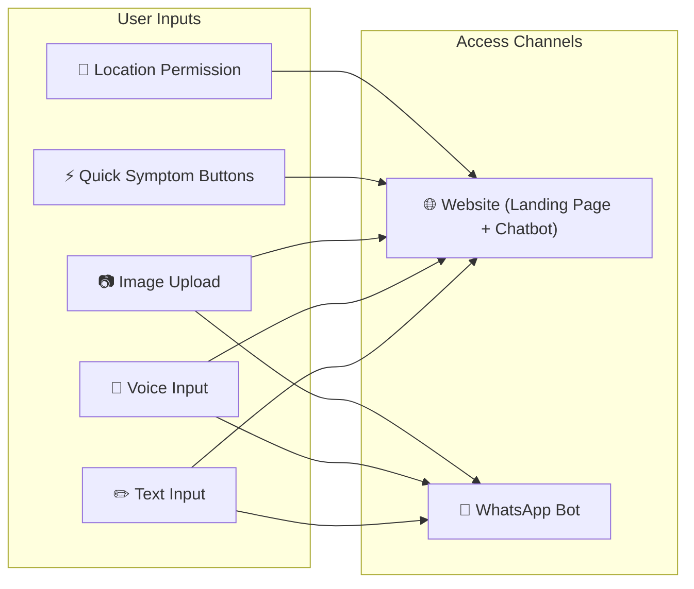

**Target Channel Capabilities (planned, not current):**

| Feature | Website | WhatsApp |
|---|---|---|
| Text Input | ✅ | ✅ |
| Voice Input | ✅ (mic button) | ✅ (voice notes) |
| Image Upload | ✅ | ✅ (send photo) |
| Quick Symptom Buttons | ✅ | ❌ (text menu instead) |
| Location Sharing | ✅ (Browser GPS) | ✅ (WhatsApp location) |
| Audio Response | ✅ (audio player) | ✅ (voice message reply) |

**Location Permission** is requested when:
- An emergency is detected
- A hospital search is required

---

## 4. Frontend Layer — Website

The website has **two major sections**: a public **Landing Page** and the **AI Chatbot** interface.

**Current Status:** ⚠ PARTIAL

Implemented today:
- landing page
- chat page
- text symptom input
- quick symptom buttons
- language selector UI
- emergency alert UI
- live text triage integration with the backend

Still missing:
- real voice flow
- real image flow
- hospital map
- patient summary card
- audio response playback

### Tech Stack

| Technology | Purpose |
|---|---|
| **Vite** | Frontend build tool and dev server |
| **React + React Router** | SPA UI rendering and routing |
| **TypeScript** | Type-safe development |
| **TailwindCSS** | Utility-first styling |
| **ShadCN UI** | Pre-built accessible components |
| **Framer Motion** | Animations & transitions |

### Website Structure

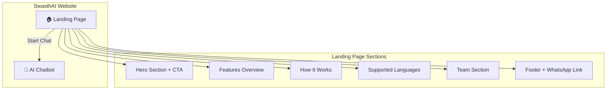

### Landing Page

The landing page is the **public-facing website** that introduces SwasthAI to visitors.

**Sections:**

| Section | Content |
|---|---|
| **Hero** | Tagline, brief description, "Start Chat" CTA button |
| **Features** | Cards for: Multilingual, Voice Input, Image Analysis, Emergency Alerts, Hospital Finder |
| **How It Works** | Step-by-step visual flow (Describe → AI Analyzes → Get Guidance) |
| **Supported Languages** | Hindi, Gujarati, Marathi, English, Tamil |
| **Team** | Team member profiles |
| **Footer** | Contact info, WhatsApp bot link, social links |

### Chatbot Interface

The chatbot is accessed from the landing page via the **"Start Chat"** button or a persistent floating chat widget.

### Component Architecture

```
frontend/
├── src/
│   ├── pages/
│   │   ├── Index.tsx               # Landing page
│   │   └── Chat.tsx                # Chatbot page
│   ├── components/
│   │   ├── landing/
│   │   │   ├── Hero.tsx
│   │   │   ├── Features.tsx
│   │   │   ├── HowItWorks.tsx
│   │   │   ├── LanguagesSection.tsx
│   │   │   ├── TeamSection.tsx
│   │   │   ├── Footer.tsx
│   │   │   ├── Navbar.tsx
│   │   │   └── FloatingChatButton.tsx
│   │   ├── chat/
│   │   │   ├── ChatUI.tsx
│   │   │   ├── MessageBubble.tsx
│   │   │   ├── InputBar.tsx
│   │   │   ├── QuickSymptomButtons.tsx
│   │   │   ├── LanguageSelector.tsx
│   │   │   └── EmergencyAlert.tsx
│   │   └── ui/
│   └── lib/
│       ├── api.ts
│       └── types.ts
```

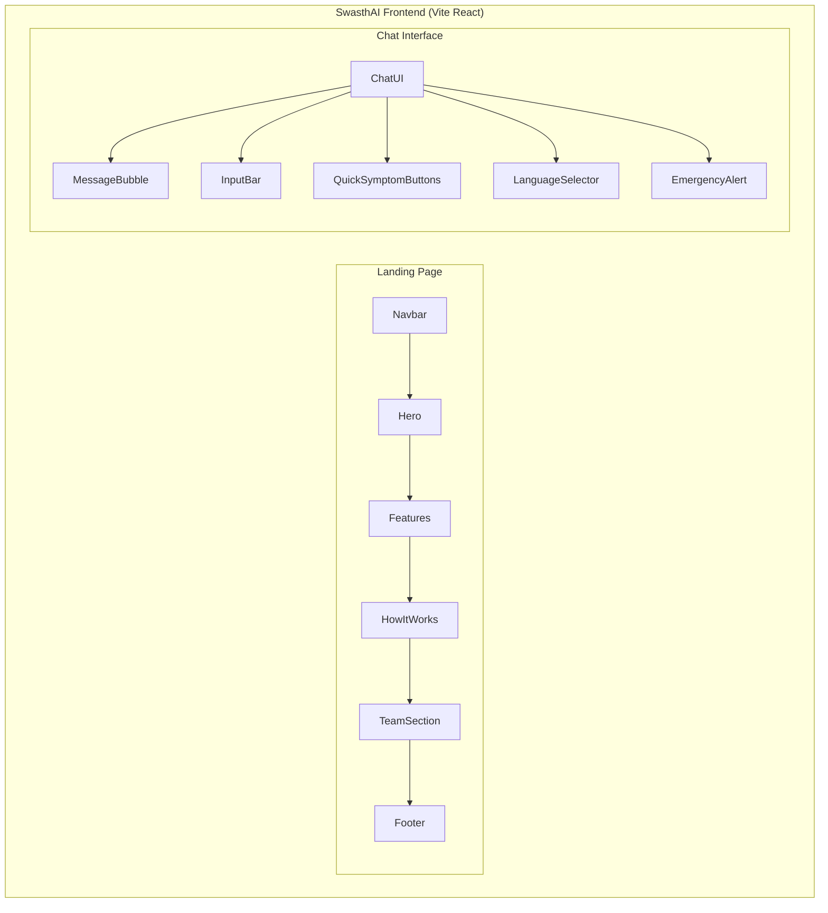

### Frontend Responsibilities

**Current MVP responsibilities:**

- **Landing page** — showcase features, team, CTA to chatbot
- Chat interface rendering
- Language selection (Hindi, Gujarati, Marathi, English, Tamil)
- Displaying triage results and emergency alerts

**Planned frontend expansions:**

- Voice recording and transcription
- Image upload and preview
- Location access via browser GPS
- Hospital map and recommendation cards
- Audio playback of AI responses
- Patient report generation

---

## 5. WhatsApp Integration Layer

SwasthAI is also accessible via **WhatsApp** — one phone number is connected as the bot. Users simply message the number to start a health consultation.

**Current Status:** ❌ NOT IMPLEMENTED

### How It Works

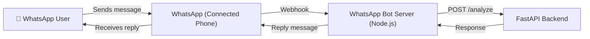

### Tech Stack

| Technology | Purpose |
|---|---|
| **Baileys** (or **whatsapp-web.js**) | Connect a single phone to WhatsApp Web via Node.js |
| **Node.js** | WhatsApp bot server |
| **Express.js** | Webhook receiver |
| **Alternative: WhatsApp Business API (Meta Cloud API)** | Official API if scaling beyond single phone |

### WhatsApp Bot Architecture

```
whatsapp-bot/
├── index.js              # Bot entry point — connects phone via QR
├── messageHandler.js     # Parses incoming messages (text/image/voice/location)
├── apiClient.js          # Sends parsed input to FastAPI /analyze endpoint
├── responseFormatter.js  # Formats AI response for WhatsApp (text + voice note)
├── sessionManager.js     # Tracks conversations per phone number
└── config.js             # API URLs, credentials, language defaults
```

### Supported Message Types

| WhatsApp Input | Mapped To |
|---|---|
| **Text message** | `text` field in `/analyze` |
| **Voice note** | Transcribed via Deepgram → `voice_text` |
| **Photo** | Converted to base64 → `image` |
| **Location share** | Extracted lat/lng → `location` |
| **"Hi" / first message** | Welcome message + language selection menu |

### WhatsApp Conversation Flow

```
User: Hi
Bot:  🩺 Welcome to SwasthAI!
      Choose your language:
      1. English
      2. हिन्दी
      3. ગુજરાતી
      4. मराठी
      5. தமிழ்

User: 2
Bot:  भाषा सेट: हिन्दी
      अपने लक्षण बताएं (टेक्स्ट, वॉइस नोट, या फोटो भेजें)

User: मुझे बुखार और सिरदर्द है
Bot:  🤖 विश्लेषण...
      📋 ट्राइएज: स्व-उपचार
      💊 सलाह: आराम करें, तरल पदार्थ पिएं...
      🏥 अगर 2 दिन में ठीक न हो तो डॉक्टर से मिलें
```

### Phone Connection Setup

1. Run the WhatsApp bot server
2. Scan **QR code** from terminal with the designated phone
3. Phone stays connected — bot listens for incoming messages
4. All messages are routed to FastAPI backend via HTTP

> ⚠️ **Note:** Only **one phone** is connected at a time. For multi-number scaling, migrate to the official **WhatsApp Business API (Meta Cloud API)**.

---

## 6. API Gateway Layer

**Current Status:** ⚠ PARTIAL

- ✅ `POST /analyze`
- ✅ FastAPI app bootstrapping
- ✅ Request and response validation
- ❌ `POST /whatsapp/webhook` in active MVP runtime
- ❌ `GET /hospitals/nearby` in active MVP runtime

### Tech Stack

| Technology | Purpose |
|---|---|
| **Python** | Core language |
| **FastAPI** | Async web framework |
| **Pydantic** | Request/response validation |
| **Uvicorn** | ASGI server |
| **HTTPX** | Async HTTP client |

### Endpoints

```
POST /analyze              # ✅ Main MVP triage endpoint
POST /whatsapp/webhook     # ❌ Planned, not part of working MVP
GET  /hospitals/nearby     # ❌ Planned, not part of working MVP
```

**Current MVP `/analyze` Request Payload:**

```json
{
  "text": "I have fever",
  "session_id": "optional_session_id",
  "language": "en",
  "channel": "web"
}
```

### Backend Architecture

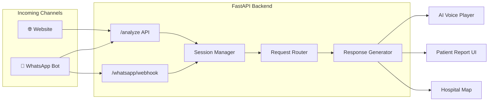

---

## 7. AI Processing Pipeline

The pipeline processes user input through **10 sequential steps**:

**Current Status by Step**

| Step | Status | Notes |
|---|---|---|
| 1. Input normalization | ⚠ | Text input only |
| 2. Speech to text | ❌ | Not implemented |
| 3. Language detection | ❌ | Not implemented in MVP path |
| 4. Translation to English | ❌ | Not implemented in MVP path |
| 5. Symptom extraction | ❌ | Removed from MVP path to keep backend simple |
| 6. Emergency rule engine | ✅ | Implemented before AI triage |
| 7. AI triage | ✅ | Implemented with Groq or rule-based fallback |
| 8. Remedies engine | ⚠ | Basic recommended actions only |
| 9. Translate back to user language | ❌ | Not implemented |
| 10. Text-to-speech | ❌ | Not implemented |

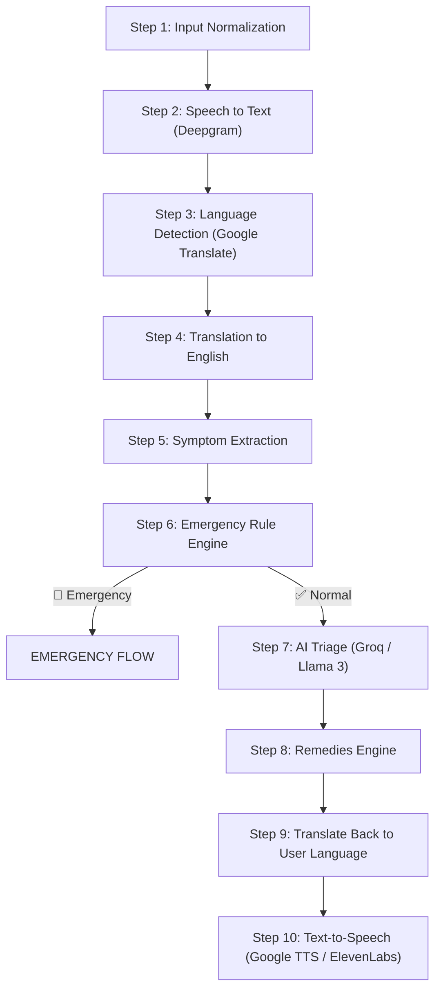

---

### Step 1 — Input Normalization

Combine all input sources into a single prompt:

```
Symptoms:
  - fever (text)
  - headache (quick button)
  - uploaded image context (image)
```

### Step 2 — Speech to Text

| Tool | Purpose |
|---|---|
| **Deepgram API** | Convert voice audio → text transcript |

```
Voice Audio → Deepgram → Text Transcript
```

### Step 3 — Language Detection

| Tool | Purpose |
|---|---|
| **Google Translate API** | Detect input language |

**Supported Languages:** Hindi, Gujarati, Marathi, English, Tamil

### Step 4 — Translation to English

Convert non-English input for AI processing:

```
"मुझे बुखार है"  →  "I have fever"
```

### Step 5 — Symptom Extraction

Extract medical keywords from normalized text:

```
Input:  "I have fever and cough"
Output: symptoms = ["fever", "cough"]
```

### Step 6 — Emergency Rule Engine

> ⚠️ **Safety-first:** Rule-based checks run **before** AI to catch critical situations immediately.

**Emergency triggers:**

| Condition | Action |
|---|---|
| Chest pain | 🚨 EMERGENCY |
| Breathing difficulty | 🚨 EMERGENCY |
| Unconsciousness | 🚨 EMERGENCY |
| Heavy bleeding | 🚨 EMERGENCY |
| Severe wound | 🚨 EMERGENCY |

If any rule matches → **Trigger Emergency Flow** immediately.

### Step 7 — AI Triage Engine

| Config | Value |
|---|---|
| **API** | Groq API |
| **Model** | Llama 3 |

**AI performs:**
- Symptom reasoning
- Urgency classification
- Advice generation
- Confidence scoring
- Image interpretation

**Triage Outputs:**

| Level | Example |
|---|---|
| `Self-Care` | Mild headache, common cold |
| `Visit Clinic` | Fever > 2 days, persistent cough |
| `Emergency` | Chest pain, unconsciousness |

**Example AI Response:**
```json
{
  "triage": "clinic",
  "reason": "Fever lasting > 2 days",
  "confidence": 0.82
}
```

### Step 8 — Remedies Engine

If triage ≠ emergency, generate safe home remedies:

- 💧 Drink fluids
- 🛌 Rest
- 🩹 Clean wound & apply antiseptic
- 🧊 Cold compress

### Step 9 — Translation Back

Convert AI response back to user's language:

```
English → Hindi / Gujarati / Marathi / Tamil
```

### Step 10 — Text-to-Speech

| Tool | Purpose |
|---|---|
| **Google TTS** | Free multilingual voice |
| **ElevenLabs** | Premium natural voice |

---

## 8. Healthcare Services Layer

**Current Status:** ⚠ PARTIAL

- ✅ Emergency escalation text with `108`
- ❌ Hospital search API integration
- ❌ Map rendering

### Emergency System

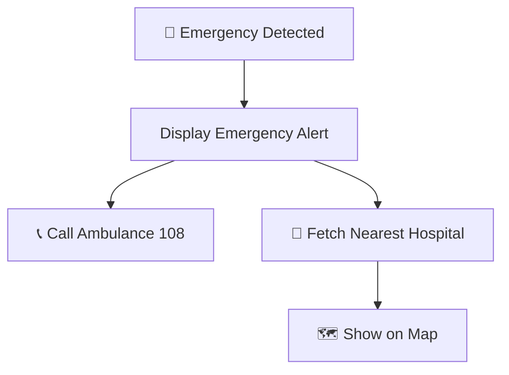

**When emergency is detected:**
1. UI displays: **🚨 Emergency Detected — Call Ambulance 108**
2. Show one-tap call button
3. Fetch nearest hospitals
4. Display hospitals on map

### Hospital Recommendation

**Input:** User's latitude & longitude

**Process:**
1. Query hospital dataset
2. Calculate distance using **Haversine Formula**
3. Sort by nearest
4. Return top hospitals

**Map Tools:**

| Tool | Purpose |
|---|---|
| **Mapbox** | Interactive map rendering |
| **Google Maps API** | Fallback / directions |

---

## 9. Data Storage Layer

**Current Status:** ❌ NOT IMPLEMENTED

The architecture below is still planned only. The current MVP uses in-memory session state and does not persist sessions, messages, or triage results to a database.

### Database: Supabase (PostgreSQL)

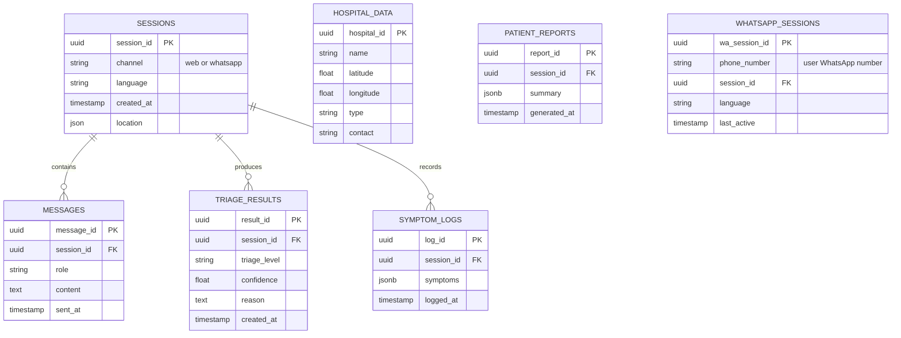

### Tables

| Table | Purpose |
|---|---|
| `sessions` | User session tracking (web + whatsapp) |
| `messages` | Chat history |
| `triage_results` | AI triage outcomes |
| `symptom_logs` | Extracted symptoms per session |
| `hospital_data` | Hospital directory |
| `patient_reports` | Generated summary reports |
| `whatsapp_sessions` | Maps WhatsApp phone numbers to sessions |

### Caching

| Tool | Purpose |
|---|---|
| **Redis** | Cache frequent queries, session state |

---

## 10. Analytics Layer

**Current Status:** ❌ NOT IMPLEMENTED

Anonymous interaction data generates population health insights:

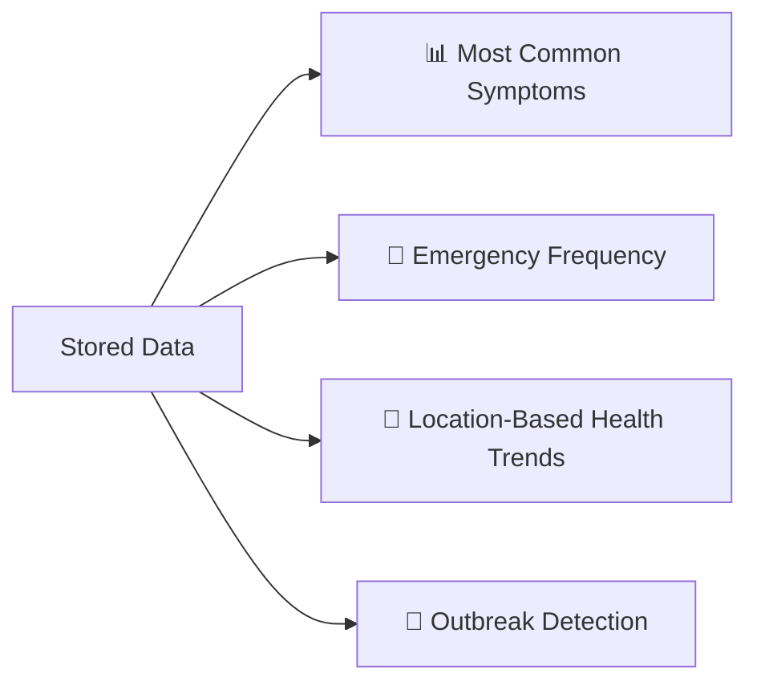

**Dashboard Tools:**

| Tool | Purpose |
|---|---|
| **Supabase Analytics** | Built-in data queries |
| **Metabase** | Visual dashboards |
| **Custom React Dashboard** | Tailored health analytics UI |

---

## 11. Infrastructure & Deployment

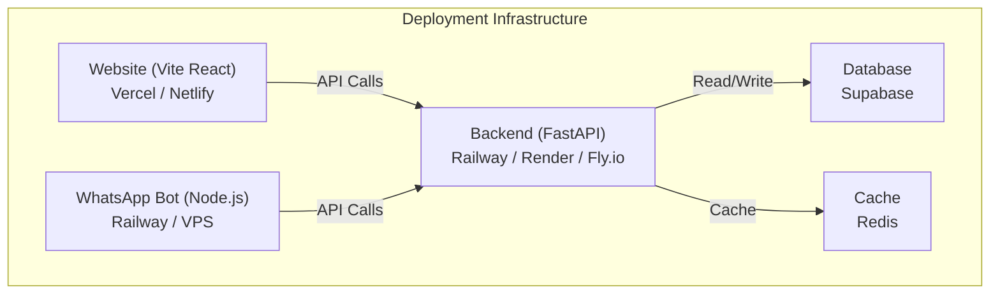

| Component | Platform |
|---|---|
| **Website (Landing + Chatbot)** | Vercel / Netlify |
| **WhatsApp Bot** | Railway / VPS (always-on process) |
| **Backend API** | Railway / Render / Fly.io |
| **Database** | Supabase |
| **Caching** | Redis |

---

## 12. Team Task Division (5 Members)

> Each member's section below is a **self-contained guide** — read your section, understand what you own, what you receive from others, and what you deliver. This is designed so all 5 members can **vibe code independently** and connect their pieces together.

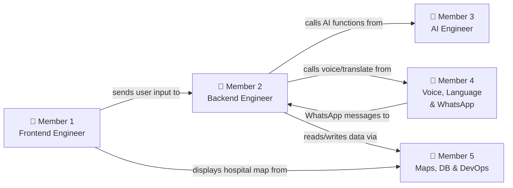

---

### 👤 Member 1 — Frontend Engineer

**Role:** Build everything the user sees on the website — the landing page and the chatbot UI.

**Tech Stack:**

| Tool | Why |
|---|---|
| **Vite** | Fast frontend build tool and dev server |
| **React Router** | Client-side routing between landing and chat pages |
| **TypeScript** | Type-safe code, fewer bugs |
| **TailwindCSS** | Fast styling with utility classes |
| **ShadCN UI** | Pre-built buttons, modals, cards, etc. |
| **Framer Motion** | Smooth animations and transitions |

**What You Build:**

#### 🏠 Landing Page (`src/pages/Index.tsx`)

This is the first thing users see when they visit the SwasthAI website.

| Section | What It Does |
|---|---|
| **Navbar** | Logo + navigation links (Features, How It Works, Team, Chat) |
| **Hero** | Big tagline like *"Your AI Health Assistant"*, a short description, and a **"Start Chat"** button |
| **Features** | 5-6 cards showing: Multilingual, Voice Input, Image Analysis, Emergency Alerts, Hospital Finder |
| **How It Works** | 3-step visual: ① Describe Symptoms → ② AI Analyzes → ③ Get Guidance |
| **Supported Languages** | Show flags/icons for Hindi, Gujarati, Marathi, English, Tamil |
| **Team** | Card per team member with photo, name, role |
| **Footer** | Contact info, WhatsApp bot number link, social links |

#### 💬 Chatbot Interface (`src/pages/Chat.tsx`)

This is the core product — the AI health assistant chat.

| Component | What It Does |
|---|---|
| **ChatUI** | Main container — holds all messages, input bar, and panels |
| **MessageBubble** | Renders individual messages (user = right, bot = left) with different styles |
| **InputBar** | Text field + send button at the bottom; voice and image controls are still disabled in the MVP |
| **QuickSymptomButtons** | Row of buttons: Fever, Pain, Headache, Wound, Breathing Issue, Bleeding |
| **LanguageSelector** | Dropdown to pick language (Hindi, English, etc.) — send `language` field to API |
| **EmergencyAlert** | 🚨 Red banner — shows when backend returns `triage: emergency` — has **Call 108** button |
| **FloatingChatButton** | Persistent bubble on landing page — click to open chat |

**Files You Own:**

```
frontend/
└── src/
    ├── pages/
    │   ├── Index.tsx
    │   └── Chat.tsx
    ├── components/
    │   ├── landing/
    │   │   ├── Navbar.tsx
    │   │   ├── Hero.tsx
    │   │   ├── Features.tsx
    │   │   ├── HowItWorks.tsx
    │   │   ├── LanguagesSection.tsx
    │   │   ├── TeamSection.tsx
    │   │   ├── Footer.tsx
    │   │   └── FloatingChatButton.tsx
    │   ├── chat/
    │   │   ├── ChatUI.tsx
    │   │   ├── MessageBubble.tsx
    │   │   ├── InputBar.tsx
    │   │   ├── QuickSymptomButtons.tsx
    │   │   ├── LanguageSelector.tsx
    │   │   └── EmergencyAlert.tsx
    │   └── ui/
    └── lib/
        ├── api.ts
        └── types.ts
```

**API You Call (built by Member 2):**

```
POST /analyze
Body: { text, language, session_id?, channel: "web" }
```

**What You Receive from Backend:**

```json
{
  "session_id": "web-uuid",
  "triage": "self-care | clinic | emergency",
  "reason": "Fever lasting > 2 days",
  "confidence": 0.82,
  "recommended_actions": ["rest", "drink fluids"],
  "is_emergency": false,
  "disclaimer": "This is AI-assisted triage, not a diagnosis."
}
```

**🚀 Start Here:**
1. Use the existing Vite React app in `frontend/`
2. Run `npm install`
3. Build the landing page in `src/pages/Index.tsx`
4. Build the chat UI in `src/pages/Chat.tsx`
5. Connect to Member 2's API once it's ready
6. Add voice, image, hospital map, and patient report features after the MVP API is stable

---

### 👤 Member 2 — Backend Engineer

**Role:** Build the FastAPI server that receives requests from the website and WhatsApp bot, routes them through the AI pipeline, and returns results.

**Tech Stack:**

| Tool | Why |
|---|---|
| **Python** | Core language for backend |
| **FastAPI** | High-performance async API framework |
| **Pydantic** | Validates request/response data automatically |
| **Uvicorn** | Runs the FastAPI server |
| **HTTPX** | Makes async HTTP calls to external APIs |

**What You Build:**

#### API Endpoints

| Endpoint | Method | Purpose |
|---|---|---|
| `/analyze` | POST | Main endpoint — receives symptoms, runs AI pipeline, returns results |
| `/whatsapp/webhook` | POST | Receives incoming WhatsApp messages from Member 4's bot |
| `/hospitals/nearby` | GET | Returns nearest hospitals by lat/lng (uses Member 5's data) |
| `/health` | GET | Health check endpoint for deployment monitoring |

#### `/analyze` — What Happens Inside

This is the **core endpoint**. When a request comes in (from website OR WhatsApp):

```
1. Validate request (Pydantic)
2. Create or resume session (session_id)
3. Run emergency rule check on the text
4. If emergency → return emergency response immediately
5. Otherwise call the AI triage function
6. Normalize confidence and recommended actions
7. Return final JSON response
```

#### Request & Response

**Current MVP Request (from website):**

```json
{
  "text": "I have fever",
  "language": "en",
  "session_id": "uuid",
  "channel": "web"
}
```

**Current MVP Response:**

```json
{
  "session_id": "uuid",
  "triage": "clinic",
  "reason": "The symptoms sound persistent or significant enough to need a clinician review.",
  "confidence": 0.72,
  "recommended_actions": [
    "Book a clinic visit within the next 24 to 48 hours.",
    "Track when symptoms started and whether they are getting worse."
  ],
  "is_emergency": false,
  "disclaimer": "This is AI-assisted triage, not a diagnosis."
}
```

**Files You Own:**

```
backend/
├── main.py                  # FastAPI app, endpoint definitions
├── routes/
│   ├── analyze.py           # /analyze endpoint logic
│   ├── whatsapp.py          # /whatsapp/webhook endpoint
│   └── hospitals.py         # /hospitals/nearby endpoint
├── services/
│   ├── pipeline.py          # Orchestrates the full AI pipeline (calls Member 3 & 4's functions)
│   ├── session_manager.py   # Create/resume sessions, track state
│   └── response_builder.py  # Build final JSON response
├── models/
│   ├── request.py           # Pydantic request models
│   └── response.py          # Pydantic response models
├── config.py                # API keys, URLs, environment config
└── requirements.txt         # Python dependencies
```

**You Depend On:**
- **Member 3** → AI functions (triage, emergency check, remedies, image analysis)
- **Member 4** → Translation, TTS, speech-to-text functions
- **Member 5** → Database read/write, hospital search

**You Deliver To:**
- **Member 1** → JSON responses for the website chatbot
- **Member 4** → JSON responses for WhatsApp bot replies

**🚀 Start Here:**
1. Use the existing backend in `backend/`
2. Keep `/analyze` working and tested before adding new inputs
3. Add translation, voice, image, and persistence one layer at a time
4. Do not wire unfinished features into the main runtime path
5. Connect to Supabase once Member 5 sets up the database

---

### 👤 Member 3 — AI Engineer

**Role:** Build the AI brain — symptom analysis, triage classification, emergency detection, remedy generation, and image interpretation.

**Tech Stack:**

| Tool | Why |
|---|---|
| **Groq API** | Ultra-fast AI inference |
| **Llama 3** | Open-source LLM for medical reasoning |
| **Prompt Engineering** | Craft precise prompts for accurate triage |

**What You Build:**

#### 1. Emergency Rule Engine

> ⚠️ This runs **BEFORE** AI — it's a fast safety check using keyword matching.

**Input:** Extracted symptoms (list of strings)
**Output:** `{ is_emergency: true/false, reason: "..." }`

**Rules — if any of these are detected, immediately return emergency:**

| Trigger Keywords | Why It's Emergency |
|---|---|
| chest pain, heart attack | Possible cardiac event |
| can't breathe, breathing difficulty, suffocating | Respiratory failure |
| unconscious, fainted, not responding | Loss of consciousness |
| heavy bleeding, blood won't stop | Hemorrhage risk |
| severe burn, deep wound | Critical injury |

```python
# Example logic
def check_emergency(symptoms: list[str]) -> dict:
    emergency_keywords = ["chest pain", "can't breathe", "unconscious", "heavy bleeding", "severe burn"]
    for symptom in symptoms:
        for keyword in emergency_keywords:
            if keyword in symptom.lower():
                return {"is_emergency": True, "reason": f"Detected: {keyword}"}
    return {"is_emergency": False, "reason": ""}
```

#### 2. AI Triage Engine (Groq + Llama 3)

**Input:** Symptoms text (in English), image description (if any)
**Output:** `{ triage, reason, confidence }`

**What the AI does:**
- Reads the symptoms
- Reasons about possible conditions
- Classifies urgency into: `self-care`, `clinic`, or `emergency`
- Explains why
- Gives a confidence score (0.0 to 1.0)

**Prompt template you'll craft:**

```
You are a medical triage assistant. Based on the following symptoms, classify the urgency.

Symptoms: {symptoms}
Image context: {image_description}

Respond in JSON:
{
  "triage": "self-care | clinic | emergency",
  "reason": "brief explanation",
  "confidence": 0.0-1.0
}
```

#### 3. Remedy Generator

**Input:** Symptoms + triage level
**Output:** List of safe home remedies (only if NOT emergency)

```python
# AI generates remedies like:
["Rest and sleep well", "Drink warm fluids", "Take paracetamol if fever > 101°F", "Apply cold compress"]
```

#### 4. Image Interpreter

**Input:** Base64 image (wound, rash, swelling)
**Output:** Text description for the AI to include in triage

```
"The image shows a red, swollen area on the forearm with possible signs of infection."
```

#### 5. Symptom Extractor

**Input:** Raw text like *"I have fever and my head hurts a lot"*
**Output:** `["fever", "headache"]`

**Files You Own:**

```
backend/
└── ai/
    ├── emergency.py         # Emergency rule engine (keyword-based)
    ├── triage.py            # Groq API call for triage classification
    ├── remedies.py          # Remedy generation via AI
    ├── image_analyzer.py    # Image interpretation via Groq vision
    ├── symptom_extractor.py # Extract symptom keywords from text
    └── prompts.py           # All prompt templates stored here
```

**You Deliver To:**
- **Member 2** → Functions that Member 2 calls inside their pipeline:
  - `check_emergency(symptoms)` → returns emergency status
  - `run_triage(symptoms, image_context)` → returns triage + reason + confidence
  - `generate_remedies(symptoms, triage)` → returns remedy list
  - `analyze_image(base64_image)` → returns image description
  - `extract_symptoms(text)` → returns symptom list

**You Depend On:**
- Nothing! You work independently. Member 2 imports your functions.

**🚀 Start Here:**
1. Get a **Groq API key** from [console.groq.com](https://console.groq.com)
2. Run `pip install groq`
3. Build `emergency.py` first — it's just keyword matching, no AI needed
4. Build `triage.py` — write the prompt, call Groq API, parse JSON response
5. Build `remedies.py` — another Groq prompt that returns safe remedies
6. Build `image_analyzer.py` — use Groq vision model for image description
7. Test each function independently with sample inputs before giving to Member 2

---

### 👤 Member 4 — Voice, Language & WhatsApp Engineer

**Role:** Handle everything related to voice input, language translation, text-to-speech, and the WhatsApp bot server.

**Tech Stack:**

| Tool | Why |
|---|---|
| **Deepgram API** | Fast, accurate speech-to-text |
| **Google Translate API** | Language detection + translation |
| **Google TTS / ElevenLabs** | Convert text responses to audio |
| **Baileys** (or **whatsapp-web.js**) | Connect WhatsApp via a single phone |
| **Node.js + Express** | WhatsApp bot server |

**What You Build:**

#### Part A — Voice & Language Functions (Python, used by Member 2)

| Function | Input | Output |
|---|---|---|
| `speech_to_text(audio_bytes)` | Voice recording from user | Text transcript |
| `detect_language(text)` | Any text | Language code (`hi`, `en`, `gu`, `mr`, `ta`) |
| `translate_to_english(text, source_lang)` | Non-English text | English translation |
| `translate_from_english(text, target_lang)` | English AI response | Response in user's language |
| `text_to_speech(text, language)` | Response text + language | Audio file URL |

**Example flow:**

```
User speaks in Hindi → audio bytes
↓ speech_to_text()
"मुझे बुखार और सिरदर्द है"
↓ detect_language()
"hi"
↓ translate_to_english()
"I have fever and headache"
→ (Member 3's AI processes this in English)
← AI response: "Take rest and drink fluids"
↓ translate_from_english(response, "hi")
"आराम करें और तरल पदार्थ पिएं"
↓ text_to_speech(hindi_text, "hi")
audio_url: "https://storage.example.com/response.mp3"
```

#### Part B — WhatsApp Bot Server (Node.js)

A separate Node.js server that connects one phone to WhatsApp and routes messages to Member 2's FastAPI backend.

**How it works:**
1. You run the bot → it shows a **QR code** in the terminal
2. Scan QR with the designated phone → phone connects
3. When someone messages this number, the bot:
   - Detects message type (text / voice note / photo / location)
   - Converts it to the `/analyze` request format
   - Sends it to Member 2's FastAPI API
   - Gets the response back
   - Formats it as a WhatsApp reply (text + voice message)
   - Sends it back to the user

**Conversation flow:**

```
User: Hi
Bot:  🩺 Welcome to SwasthAI!
      Choose your language:
      1. English  2. हिन्दी  3. ગુજરાતી  4. मराठी  5. தமிழ்

User: 2
Bot:  भाषा सेट: हिन्दी। अपने लक्षण बताएं।

User: [sends voice note in Hindi]
Bot:  🤖 विश्लेषण...
      📋 ट्राइएज: स्व-उपचार
      💊 सलाह: आराम करें, तरल पदार्थ पिएं
      🏥 अगर 2 दिन में ठीक न हो तो डॉक्टर से मिलें
      [sends voice message with the same response]

User: [sends photo of wound]
Bot:  🔍 छवि का विश्लेषण...
      📋 ट्राइएज: क्लिनिक जाएं
      🩹 घाव को साफ पानी से धोएं, एंटीसेप्टिक लगाएं
      🏥 नजदीकी क्लिनिक: [hospital name, 1.5 km]
```

**Files You Own:**

```
# Python functions (inside backend/)
backend/
└── services/
    ├── speech.py           # speech_to_text() using Deepgram
    ├── translator.py       # detect_language(), translate_to/from_english()
    └── tts.py              # text_to_speech() using Google TTS / ElevenLabs

# WhatsApp bot (separate Node.js project)
whatsapp-bot/
├── index.js                # Entry point — connects phone via QR code
├── messageHandler.js       # Parses incoming messages (text/voice/image/location)
├── apiClient.js            # Sends requests to FastAPI /analyze endpoint
├── responseFormatter.js    # Formats AI response for WhatsApp (text + voice note)
├── sessionManager.js       # Tracks conversation state per phone number
├── config.js               # API URLs, language defaults
└── package.json            # Node.js dependencies
```

**You Deliver To:**
- **Member 2** → Python functions for speech, translation, TTS (Member 2 imports and calls them)
- **Member 2** → WhatsApp bot sends HTTP requests to Member 2's `/analyze` endpoint

**You Depend On:**
- **Member 2** → `/analyze` API must be running for WhatsApp bot to work

**🚀 Start Here:**
1. **Voice & Language (Python):** Get Deepgram + Google Translate API keys. Build `speech.py`, `translator.py`, `tts.py`. Test each function with sample audio/text.
2. **WhatsApp Bot (Node.js):** Run `npm init`, install `baileys` (or `whatsapp-web.js`). Build `index.js` — get QR code working. Then build `messageHandler.js` to detect message types. Connect to Member 2's API last.

---

### 👤 Member 5 — Maps, Database & DevOps

**Role:** Set up the database, hospital search, location services, deployment, and analytics dashboard.

**Tech Stack:**

| Tool | Why |
|---|---|
| **Supabase** | PostgreSQL database with built-in auth & APIs |
| **Mapbox / Google Maps API** | Hospital map rendering & directions |
| **Redis** | Caching frequent queries for speed |
| **Docker** | Containerize services for deployment |
| **Vercel / Netlify** | Deploy the Vite React website |
| **Railway / VPS** | Deploy FastAPI backend + WhatsApp bot |

**What You Build:**

#### 1. Database Schema (Supabase)

Create these tables in Supabase:

| Table | Purpose | Key Columns |
|---|---|---|
| `sessions` | Track each user conversation | `session_id`, `channel` (web/whatsapp), `language`, `location`, `created_at` |
| `messages` | Store chat history | `message_id`, `session_id`, `role` (user/bot), `content`, `sent_at` |
| `triage_results` | Store AI triage outcomes | `result_id`, `session_id`, `triage_level`, `confidence`, `reason`, `created_at` |
| `symptom_logs` | Log extracted symptoms | `log_id`, `session_id`, `symptoms` (JSONB), `logged_at` |
| `hospital_data` | Hospital directory | `hospital_id`, `name`, `latitude`, `longitude`, `type`, `contact` |
| `patient_reports` | Generated summaries | `report_id`, `session_id`, `summary` (JSONB), `generated_at` |
| `whatsapp_sessions` | Map WhatsApp phone → session | `wa_session_id`, `phone_number`, `session_id`, `language`, `last_active` |

**Give Member 2 these helper functions:**

```python
# database.py
def create_session(session_id, channel, language, location) -> None
def save_message(session_id, role, content) -> None
def save_triage_result(session_id, triage_level, confidence, reason) -> None
def save_symptom_log(session_id, symptoms) -> None
def get_session(session_id) -> dict
```

#### 2. Hospital Search

**Input:** User's latitude & longitude
**Output:** Top 5 nearest hospitals with name, distance, contact

**How it works:**
1. Store hospital data in Supabase `hospital_data` table
2. When user shares location, calculate distance using **Haversine Formula**
3. Sort by distance, return top 5

```python
# hospitals.py
def find_nearest_hospitals(lat: float, lng: float, limit: int = 5) -> list[dict]:
    # Query hospital_data table
    # Calculate distance using Haversine
    # Return sorted list: [{ name, lat, lng, distance, contact }]
```

#### 3. Location Service

Provide a helper for Member 1 to request browser GPS:

```javascript
// Used by frontend to get user location
navigator.geolocation.getCurrentPosition(
  (pos) => { lat = pos.coords.latitude; lng = pos.coords.longitude; }
);
```

#### 4. Deployment

| What | Where | How |
|---|---|---|
| **Vite React website** | Vercel / Netlify | Connect GitHub repo → auto-deploy |
| **FastAPI backend** | Railway / Render | Docker container or direct deploy |
| **WhatsApp bot** | Railway / VPS | Always-on Node.js process (needs persistent connection) |
| **Supabase** | Supabase Cloud | Already hosted |
| **Redis** | Railway / Upstash | Managed Redis instance |

#### 5. Analytics Dashboard

Build a simple dashboard (for example a React route at `/admin`) showing:

| Metric | Query |
|---|---|
| **Most common symptoms** | `SELECT symptoms, COUNT(*) FROM symptom_logs GROUP BY symptoms` |
| **Emergency frequency** | `SELECT COUNT(*) FROM triage_results WHERE triage_level = 'emergency'` |
| **Usage by language** | `SELECT language, COUNT(*) FROM sessions GROUP BY language` |
| **Usage by channel** | `SELECT channel, COUNT(*) FROM sessions GROUP BY channel` |
| **Location-based trends** | Heatmap from session locations |

**Files You Own:**

```
backend/
└── services/
    ├── database.py          # Supabase read/write functions
    ├── hospitals.py         # Hospital search + Haversine distance
    └── cache.py             # Redis caching helpers

# Deployment configs
├── Dockerfile               # Backend container
├── docker-compose.yml       # Local dev with all services
├── .env.example             # Required environment variables
└── vercel.json              # Frontend deployment config

# Analytics (inside frontend)
frontend/
└── src/
    └── pages/
        └── AdminDashboard.tsx    # Analytics dashboard page
```

**You Deliver To:**
- **Member 2** → Database functions (`database.py`), hospital search (`hospitals.py`)
- **Member 1** → Hospital data format for the map component
- **Everyone** → Deployed URLs for testing

**You Depend On:**
- **Member 1** → Frontend code to deploy on Vercel or Netlify
- **Member 2** → Backend code to deploy on Railway
- **Member 4** → WhatsApp bot code to deploy on VPS

**🚀 Start Here:**
1. Create a **Supabase project** at [supabase.com](https://supabase.com)
2. Create all 7 tables using the SQL editor
3. Populate `hospital_data` with real hospital data (start with 20-30 hospitals in your city)
4. Build `database.py` and `hospitals.py` — test with sample data
5. Set up deployment: connect GitHub to Vercel or Netlify (frontend) and Railway (backend)
6. Build the analytics dashboard last — it needs real data from usage

---

## 13. End-to-End System Flow

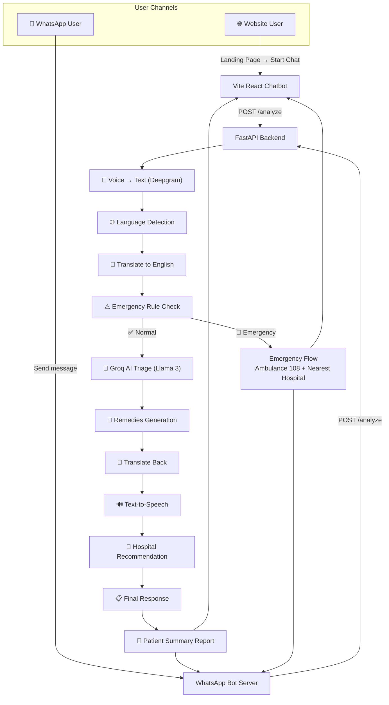

---

> **Built with ❤️ by the SwasthAI Team**
