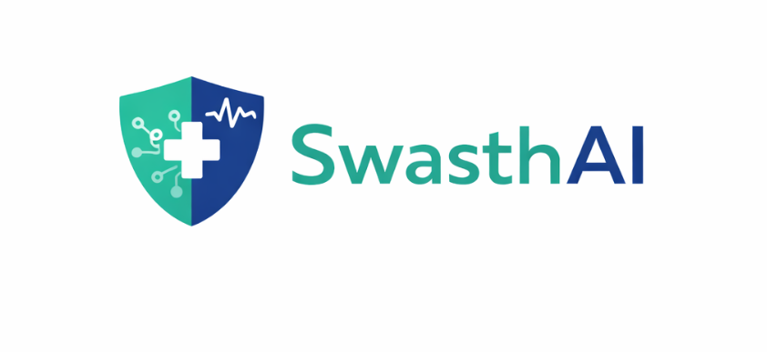

<h1 align="center">
  <br>
  
  <br>
  SwasthAI
  <br>
</h1>

<h4 align="center">Rural-first AI Health Triage & Support System</h4>

<p align="center">
  <a href="#about-the-project">📖 About the Project</a> •
  <a href="#core-features-and-ui-workflows">✨ Features & Workflows</a> •
  <a href="#system-architecture">🏗️ Architecture</a> •
  <a href="#detailed-tech-stack">⚙️ Tech Stack</a> •
  <a href="#comprehensive-file-structure">🗂️ File Structure</a> •
  <a href="#ai--machine-learning-integration">🧠 AI/ML Integration</a> •
  <a href="#database-schema">💾 Database Schema</a> •
  <a href="#api-documentation">🔌 API Documentation</a> •
  <a href="#getting-started">🚀 Getting Started</a> •
  <a href="#future-roadmap">🗺️ Roadmap</a>
</p>

---

## 📖 About the Project

**SwasthAI** is an AI-powered health triage, diagnosis, and case management platform designed explicitly for the unique challenges of rural India and developing regions. 

In areas where doctor-to-patient ratios are drastically low and internet access is patchy, SwasthAI acts as a critical first line of defense. It translates complex medical symptoms from low-resource regional languages (and "Hinglish/Gujlish") into standardized medical terminology, consults an advanced LLM, and provides instant triage recommendations to prevent unnecessary hospital visits or escalate critical emergencies.

### Three Pillars of SwasthAI:
1. **Patients & Families:** A completely frictionless, multilingual chat interface.
2. **ASHA Workers (Community Health Workers):** A highly specialized portal to quickly log patient symptoms during field visits and get second-opinion triage.
3. **District Admins (Medical Officers):** A macro-level dashboard to monitor disease outbreaks, track worker performance, and dynamically allocate mobile health units.

---

## ✨ Core Features and UI Workflows

The application is split into specialized domains securely routed from the **Landing Portal**.

### 1. Landing Portal


The entry point of the application securely routes users to their specific domain: `Start Chat` for patients, `Login as ASHA Worker` for community health workers, and `Login as Admin` for district officers.

### 2. Patient Chat Triage


A highly intuitive, chat-based interface.
* **Multilingual:** Users can type in native scripts (e.g., ગુજરાતી, हिंदी) or "Hinglish/Gujlish" (e.g., *mane tav aave chhe*).
* **AI Analysis:** The Meta NLLB offline translations run and feed symptoms into Groq LLM (Llama 3), which instantly returns:
  * Probable disease (based on extensive datasets).
  * Triage urgency (Emergency / Clinic / Home care).
  * Follow-up questions.
* **Location Integration:** Instantly displays the nearest medical facilities using Haversine distance calculations based on the required triage level.


### 3. ASHA Worker Dashboard


* **Profile & Coverage:** ASHA workers register their assigned Village, Block, District, and Household coverage numbers.
* **Case Entry:** While visiting a home, the ASHA worker inputs the patient's name, age, days sick, and symptoms. The integrated AI instantly recommends the safest triage result (e.g., Referral vs Home Care) directly from the field.


### 4. District Admin Master Dashboard


* **Worker Surveillance Matrix:** Real-time visibility into every ASHA worker's daily visits, submitted cases, and critical "Urgent" alerts across the district.
* **Epidemiological Watchlist:** Tracks spikes in specific symptoms (like widespread fever/diarrhea in a specific block) enabling early warning systems for outbreaks (like Dengue or Cholera).
* **Targeted Resource Deployment:** Enables Chief Medical Officers to deploy Mobile Medical Vans precisely where urgency metrics are spiking.


---

## 🏗️ System Architecture

SwasthAI utilizes a loosely coupled **Client-Server Architecture** optimized for edge deployments and low-bandwidth resilience.

1. **Frontend Layer:** A Vite + React Single Page Application (SPA). Employs Zustand for state, ensuring the app remains snappy even on low-end smartphones.
2. **API Gateway & Routing:** FastAPI handles asynchronous requests via `uvicorn`.
3. **AI Pipeline Layer:** Coordinates translation, symptom extraction, prompt engineering, LLM inference, and response localization (see [Machine Learning Integration](#ai--machine-learning-integration)).
4. **Service & Database Layer:** Supabase handles PostgreSQL storage and Session management.

*(A fully detailed Mermaid diagram of the architecture exists in `ARCHITECTURE.md`)*

---

## ⚙️ Detailed Tech Stack

### Frontend Application
- **Framework:** React 18, Vite (for blazing fast HMR and builds).
- **Routing:** React Router v6 (Client-side routing with lazy loading).
- **State Management:** Zustand (Immutable state management for Session IDs and Auth).
- **Design System:** TailwindCSS + Shadcn/ui (Accessible, unstyled Radix Primitives).
- **Icons & Typography:** Lucide React, Google Inter Font.

### Backend Infrastructure
- **Core:** Python 3.11+, FastAPI (Starlette + Pydantic).
- **Serverless/Runtime:** Uvicorn ASGI server.
- **Database:** Supabase (PostgreSQL 15), SQLAlchemy bindings (if needed).
- **Geohashing:** Haversine formula for local hospital lookups.

### AI & Language Models
- **Generative AI:** Groq API running `Llama-3-70b-8192` or `Llama-3-8b-8192` for near-zero latency inference.
- **Machine Translation:** `facebook/nllb-200-distilled-600M` run locally via HuggingFace `transformers` and `torch`.
- **Language Detection:** `langdetect` + Regex script bounding (Devanagari/Gujarati Unicode blocks).

---

## 🗂️ Comprehensive File Structure

The monorepo contains both the frontend client and the backend python server.

```text
SwasthAI/
│
├── frontend/                     # React + Vite Application
│   ├── package.json              # NPM dependencies & scripts
│   ├── tailwind.config.js        # Tailwind theme config & colors
│   ├── vite.config.ts            # Vite proxy & build settings
│   ├── index.html                # Main DOM container
│   └── src/
│       ├── App.tsx               # Main Router mapped to Pages
│       ├── main.tsx              # React Root Render
│       ├── index.css             # Tailwind base & layout utilities
│       ├── lib/
│       │   ├── api.ts            # Axios instances intercepting API routes
│       │   ├── store.ts          # Zustand store for user session / preferences
│       │   └── types.ts          # TS Interfaces, Enums, Static Gujarati/Hindi strings
│       ├── components/
│       │   ├── ui/               # Reusable UI components (Buttons, Inputs, Cards)
│       │   ├── layout/           # Shared structures (Header, Footer, Navbar)
│       │   └── chat/             # Patient Chat Engine (ChatUI, MessageBubble, InputData)
│       └── pages/
│           ├── Home.tsx          # 3-Card Role Selector Landing Page
│           ├── Chat.tsx          # Patient conversational interface wrapper
│           ├── AshaPortal.tsx    # ASHA Worker details & Data Entry form
│           └── AdminPortal.tsx   # Aggregated District Table & Watchlist
│
├── backend/                      # Python FastAPI Application
│   ├── main.py                   # Central fastAPI app, CORS setup, Server Lifecycle
│   ├── config.py                 # Pydantic BaseSettings loading .env
│   ├── requirements.txt          # Python packages (fastapi, uvicorn, torch, groq)
│   ├── supabase_mvp_schema.sql   # raw SQL for Supabase table generation
│   ├── models/                   # Request/Response Data Contracts (Validation)
│   │   ├── request.py            # `AnalyzeRequest` & WhatsApp Webhooks
│   │   └── response.py           # `AnalyzeResponse`, `FacilityInfo`
│   ├── routes/                   # HTTP Route Controllers
│   │   ├── analyze.py            # POST /analyze (The Chat Engine)
│   │   ├── hospitals.py          # GET /facilities/nearby (Lat/Lng Search)
│   │   └── whatsapp.py           # POST /whatsapp/webhook (Twilio/Baileys entry)
│   ├── services/                 # Reusable Business Logic
│   │   ├── pipeline.py           # The Master AI Orchestrator
│   │   ├── database.py           # Supabase client singletons & functions
│   │   ├── session_manager.py    # Redis/In-memory Chat History
│   │   ├── hospitals_service.py  # Dictionary mapping & Haversine formulas
│   │   └── translator.py         # The Offline AI Translation Engine (NLLB)
│   └── ai/                       # The Intelligence Layer
│       ├── triage.py             # LLM API calls, parameter clamping, Fallbacks
│       ├── emergency.py          # Deterministic Regex for instant 108 mapping
│       ├── remedies.py           # RAG-style homecare retrieval
│       ├── disease_predictor.py  # Machine Learning disease classification mappings
│       ├── llm_client.py         # Async Groq Client instantiator
│       └── prompts.py            # The Master System Prompt dictating LLM behavior
│
├── .gitignore                    # standard exclusions (venv, node_modules, datasets)
├── ARCHITECTURE.md               # Further low-level system design documents
└── README.md                     # You are here!
```

---

## 🧠 AI & Machine Learning Integration

SwasthAI uses a highly optimized, multi-tier intelligence pipeline to keep costs low and latency under 1 second.

### 1. Pre-Processing & Language Detection
When text enters the `pipeline.py`, a fast-regex block checks for regional Unicode characters. If none exist (Latin script), `langdetect` evaluates it. If it is recognized as Gujlish/Hinglish (e.g. `mane tav aave chhe`), it hits the **Static Term Map** which immediately translates rural colloquialisms into English ("I have fever").

### 2. The NLLB Offline Translation Engine
If the text is complex regional script (e.g., *મને ૩ દિવસથી તાવ છે*), it bypasses cloud APIs. The `Backend/services/translator.py` initializes a Singleton instance of Meta's `facebook/nllb-200-distilled-600M` model using HuggingFace PyTorch. It runs translation locally via CPU/GPU to generate standardized English before feeding the LLM.

### 3. The Generative Triage LLM (Groq Llama-3)
The normalized English is pushed to Llama-3 via Groq. The strict System Prompt (in `ai/prompts.py`) forces the LLM to return structured JSON containing:
- `triage`: Must be `self-care`, `clinic`, or `emergency`.
- `needs_more_info`: Boolean toggling follow-up question loops.
- `reason`: The medical justification.

### 4. Post-Processing & Localization Fallbacks
The LLM's English output must be displayed in the user's language. To prevent NLLB from hallucinating on short sentences, a **Static Translation Fallback** intercepts known LLM strings (e.g., "Unknown symptoms" -> "અજ્ઞાત લક્ષણો") ensuring grammatically perfect, instant regional responses.

---

## 💾 Database Schema

The backend uses **Supabase** (PostgreSQL) tracking longitudinal patient data for the District Dashboard.

| Table Name | Description | Columns |
|------------|-------------|---------|
| `sessions` | Tracks unique chat or worker sessions. | `session_id` (PK), `channel` (web/wa), `language`, `location` (JSON), `created_at` |
| `messages` | Chat history for contextual AI memory. | `id` (PK), `session_id` (FK), `role` (user/assistant), `content`, `created_at` |
| `triage_results` | Logs the final output of the AI pipeline. | `id` (PK), `session_id` (FK), `triage` (self-care/clinic/emergency), `reason`, `confidence`, `created_at` |

*(Run `supabase_mvp_schema.sql` in your Supabase SQL editor to scaffold).*

---

## 🔌 API Documentation

### 1. `POST /analyze`
**Purpose:** The core AI triage engine.
**Request Body:**
```json
{
  "session_id": "123e4567-e89b-12d3...",
  "text": "છાતીમાં દુખાવો",
  "language": "gu",
  "channel": "web",
  "location": { "lat": 23.2156, "lng": 72.6369 }
}
```
**Response:**
```json
{
  "triage": "emergency",
  "reason": "Possible cardiac emergency.",
  "recommended_actions": ["Call 108 immediately.", "Do not drive yourself."],
  "facilities": [
    { "id": "f2", "name": "Civil Hospital, Gandhinagar", "type": "hospital", "distance_km": 2.4 }
  ]
}
```

### 2. `GET /facilities/nearby`
**Purpose:** Fetches geographical clinics matching the triage intensity.
**Query Params:** `lat` (float), `lng` (float), `triage` (string: clinic|emergency).

---

## 🚀 Getting Started

### Prerequisites
- [Node.js](https://nodejs.org/) (v18+)
- [Python](https://www.python.org/downloads/) (v3.11+)
- [Supabase](https://supabase.com/) Account & Project
- [Groq](https://groq.com/) API Key for LLM

### 1. Setup the Backend API
```bash
# Clone the repo and enter backend
cd SwasthAI/backend

# Initialize virtual environment
python3 -m venv venv
source venv/bin/activate  # On Windows: venv\Scripts\activate

# Install heavy ML dependencies (takes a few minutes to download PyTorch)
pip install -r requirements.txt

# Create environment variables
cp .env.example .env
# Edit .env and insert your GROQ_API_KEY, SUPABASE_URL, and SUPABASE_KEY

# Start the FastAPI server (Keep this terminal open)
# Note: The first run downloads ~600MB of NLLB weights.
PYTHONPATH=. uvicorn backend.main:app --reload --host 127.0.0.1 --port 8000
```

### 2. Setup the Frontend Client
```bash
# Open a new terminal tab
cd SwasthAI/frontend

# Install node dependencies
npm install

# Start the Vite React development server
npm run dev
```
Navigate to `http://localhost:5173` (or the port Vite provides) in your browser. 

---

## 🗺️ Future Roadmap

1. **WhatsApp & SMS Webhooks:** Finalize the Node.js/Twilio bridging to allow citizens with basic feature phones to SMS symptoms to a central number and receive vernacular triage.
2. **Offline-First ASHA Portal (PWA):** Convert the React ASHA portal into an offline-capable Progressive Web App using IndexedDB/SQLite so workers can log cases deep in rural villages with zero cell signal, syncing automatically when connectivity returns.
3. **Deepgram Voice Transcription:** Wire the backend to accept `.ogg` or `.wav` streams, using Deepgram's Hindi/Indian English models to bypass the keyboard entirely.
4. **Computer Vision (Dermatology):** Add image upload routing for rashes/wounds, processed by a separate vision model returning classifications to the Llama-3 aggregator.

---
<p align="center">
  <i>Built to bridge the healthcare gap. Empowering rural India with AI.</i>
</p>
